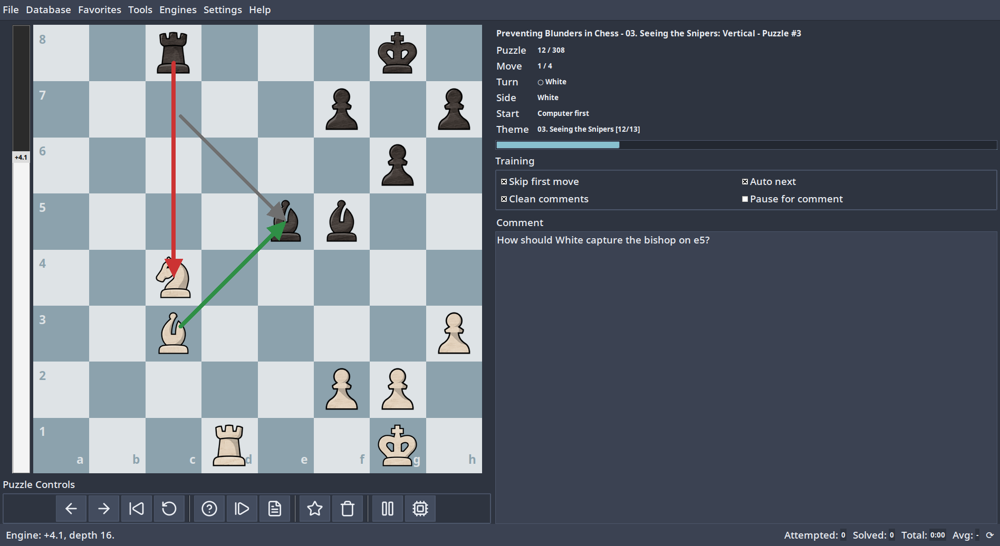

# Chess Puzzles Trainer



I built this to improve my tactical vision. I had a collection of PGN
puzzle files and wanted a keyboard-driven way to solve them on my computer.
Later I added support for puzzles from [Lichess puzzles](https://database.lichess.org/lichess_db_puzzle.csv.zst).

Puzzle solving is the focus of this tool. Everything else revolves around that.

## Download

Get the latest build from the
[Releases](https://github.com/medwatt/chess-puzzles-trainer/releases) page. Download
the zip for your platform, extract it, and double-click the executable. No
Python needed.

Or install from source:

```bash
pip install git+https://github.com/medwatt/chess-puzzles-trainer.git
chess-puzzles-trainer
```

Requires Python 3.11+. The only dependency is `python-chess`.

## Building from source

If you want a standalone binary instead of running from source:

```bash
# Linux
./scripts/build_linux.sh
# Output: dist/chess-puzzles-trainer/

# Windows (PowerShell)
.\scripts\build_windows.ps1
# Output: dist\chess-puzzles-trainer\
```

